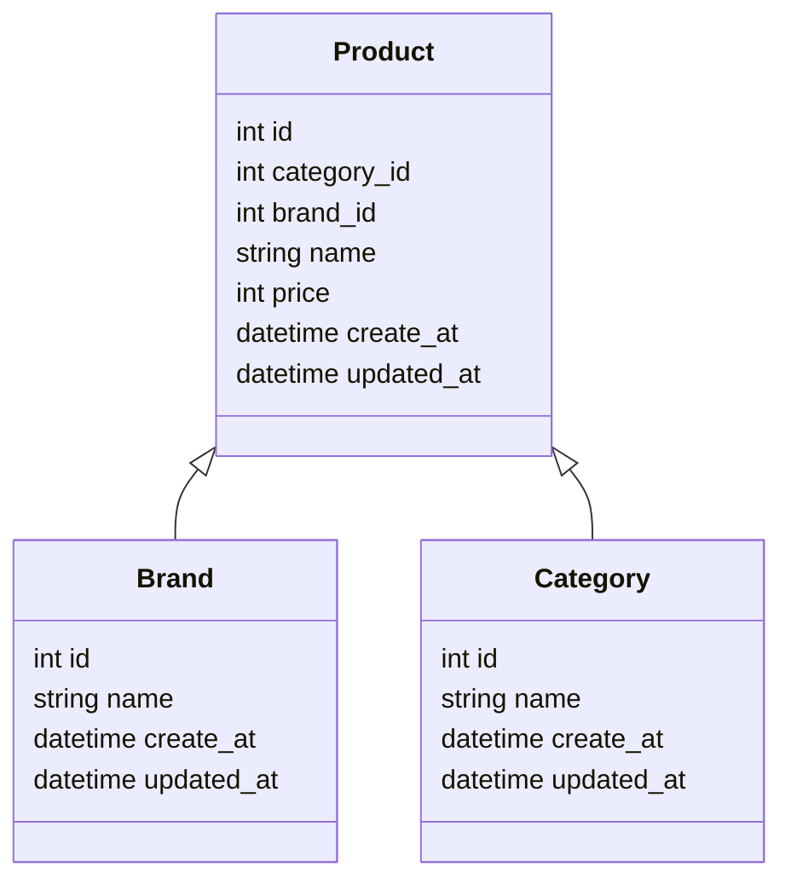

# ReadME

## 구현범위에대한설명
### DB


### API

구현 1) - 카테고리 별 최저가격 브랜드와 상품 가격, 총액을 조회하는 API
[get] /products/lowest-price-by-category
* Request
```json

```
* Response
```json
{
  "products": [
    {
      "category": "상위",
      "brand": "C",
      "price": 10000
    },
    ...
  ],
  "total_price": 34100
}
```

구현 2) - 단일 브랜드로 모든 카테고리 상품을 구매할 때 최저가격에 판매하는 브랜드와 카테고리의 상품가격, 총액을 조회하는 API
[get] /products/lowest-price-by-brands
* Request
```json

```
* Response
```json
{
  "brand": "D",
  "categories": [
    {
      "category": "상위",
      "price": 10000
    },
    ...
  ],
  "total_price": 34100
}
```

구현 3) - 카테고리 이름으로 최저, 최고 가격 브랜드와 상품 가격을 조회하는 API
[get] /products/price-range
* Request
```json
  category
```
* Response
```json
{
  "brand": "D",
  "products": [
    {
      "category": "상위",
      "price": 10000
    },
    ...
  ],
  "total_price": 34100
}
```

## 코드 빌드, 테스트, 실행 방법
### 코드 빌드
```bash
./gradlew build
```

### 테스트
```bash
./gradlew test
```

### 실행
```bash
./gradlew bootRun
```

### Swagger
http://localhost:8080/swagger-ui/index.html
* swagger 에서 테스트를 용이하기 위해 data.sql 에 init data 를 입력했습니다.